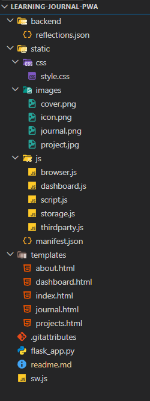

# Learning Journal PWA

A **Progressive Web App (PWA)** to document weekly learning reflections, showcase projects, and visualize insights from your journal entries. Built with **Flask**, **HTML/CSS/JS**, and enhanced with **offline capabilities** and a **dashboard for word analysis**.

---

## Table of Contents
- [Features](#features)
- [Project Structure](#project-structure)
- [Installation](#installation)
- [API Endpoints](#api-endpoints)
- [Offline Support](#offline-support)
- [Technologies Used](#technologies-used)
- [Live Link](#live-link)

---

## Features
- **Weekly Learning Journal**
  - Add, view, and delete journal entries.
  - Offline support: cached entries via `localStorage`.
  - Notifications when new entries are saved.
- **Projects Showcase**
  - Display your featured projects with GitHub and live links.
  - Embedded YouTube videos for project demos.
- **Dashboard**
  - Visual analysis of reflections using word frequency charts and word clouds.
- **Theme Switching**
  - Toggle between light and dark mode with persistence.
- **Progressive Web App**
  - Works offline using a service worker.
  - Installable on desktops and mobile devices.

---

## Project Structure



## Installation

1. **Clone the repository**

```bash
git clone https://github.com/magartamana64-hub/learning-journal-pwa.git
cd learning-journal-pwa
```

2. **Create a virtual environment**
```bash
python -m venv venv
source venv/bin/activate   # Linux/macOS
venv\Scripts\activate      # Windows
```

3. **Install dependencies**
```bash
pip install Flask
```

4. **Run the app**
```bash
python app.py
```

5. **Access in browser**
```bash
http://127.0.0.1:5000/
```

#API Endpoints

| Endpoint                  | Method | Description                |
| ------------------------- | ------ | -------------------------- |
| `/api/reflections`        | GET    | Get all reflections        |
| `/api/add_reflection`     | POST   | Add a new reflection       |
| `/api/delete/<int:index>` | DELETE | Delete reflection by index |

## Offline Support
- Service worker caches assets for offline usage.
- Reflections are stored in `localStorage` for offline reading.
- Offline banner shows when the app is disconnected.
- New entries cannot be saved offline (alerts the user).

## Technologies Used
- **Backend:** Python, Flask
- **Frontend:** HTML5, CSS3, JavaScript
- **PWA Features:** Service Worker, Manifest, Offline Caching
- **Data Storage:** JSON file (`backend/reflections.json`) + `localStorage`
- **Charts:** Chart.js for dashboard
- **Other:** Clipboard API, Notification API

## Live Link
PythonAnywhere: https://tamanamagar.pythonanywhere.com/

